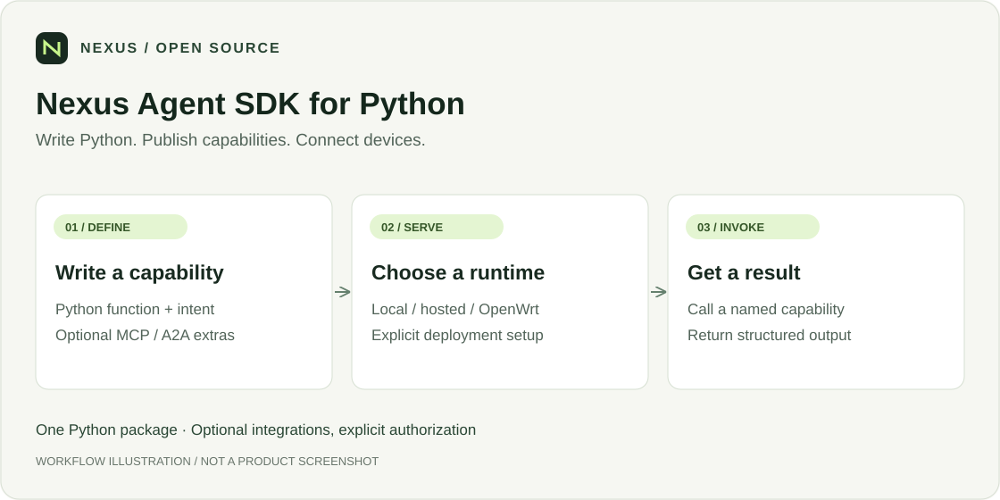
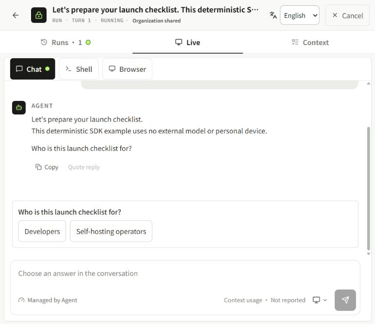
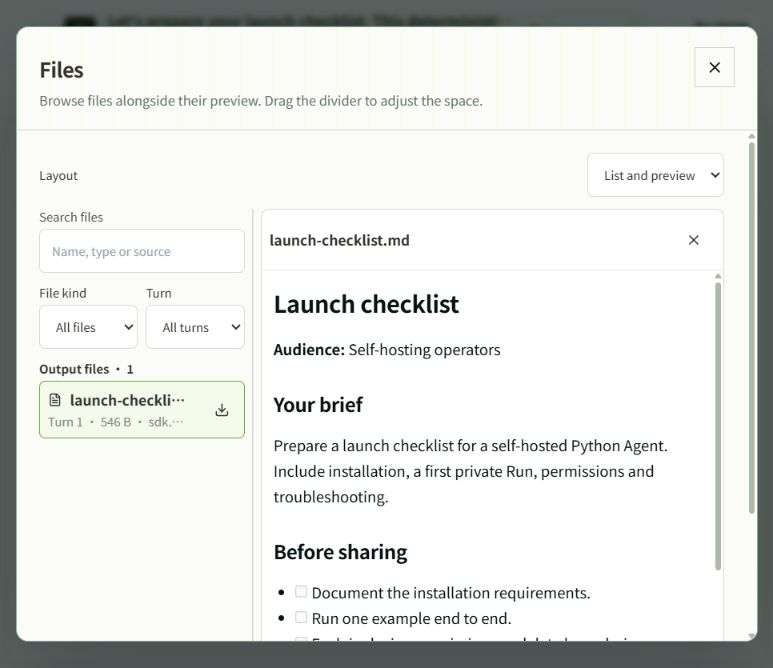

<div align="center">

# Nexus Agent SDK for Python

**Write Python. Publish capabilities. Connect devices.**

[](https://pypi.org/project/nexilume/)
[](https://pypi.org/project/nexilume/)
[](LICENSE)
[](README_GUIDE.md)
[](#引用)
[](https://github.com/Nexilume-AI/nexus-agent-sdk-python/actions/workflows/ci.yml)

`Python` · `MCP` · `Computer Runtime`

[English](README.md) · **简体中文**

[功能](#可以做什么) · [快速开始](#快速开始) · [项目生态](#项目生态) · [参与贡献](#参与贡献) · [引用](#引用)

</div>

0.47.1 已补齐依赖声明：Computer Tool Setup 在
Python 3.9/3.10 使用 `tomli`，MCP/A2A 显式声明直接依赖，`fastmcp-tasks`
安装入口改用官方 `fastmcp[tasks]`。旧版发布文件保持不变。
核心与 Computer 支持 Python 3.9+，Browser/FastMCP/A2A 需要 3.10+，推荐 3.12。
Browser 二进制和系统库、Docker 及 Provider 镜像不由 pip 自动安装；
`windows` extra 用于 Windows 地址/服务辅助功能，普通 Computer 配对不需要它。
详见[依赖兼容说明](README_GUIDE.md#dependency-compatibility)。

用 Python 构建 Agent、提供 MCP 工具、向 OpenWrt 注册，以及将已授权的 Computer Runtime 连接到 Cloud。



*这是流程示意图，不是产品截图。实际连接需要完成下文的安装、配置与授权。*

## 从 Python 到 Private Run

**Enterprise 企业版界面，2026 年 10 月 1 日采集。** 真实 Docker 托管示例使用
`NexusMCPServer`、`plan`、`chat.ask()` 和私有文件上传。示例采用确定性逻辑，不调用付费模型，
不访问个人设备。



<details>
<summary>查看生成的 Markdown 文件</summary>



</details>

[采集记录与复现步骤](docs/media/capture-notes.md)。Cloud UI 需另行部署；企业版截图不代表社区版包含其中的全部功能。

## 可以做什么

- 用 Python 函数发布可调用的 Agent capability。
- 通过可选 FastMCP 集成提供 MCP 工具。
- 向 OpenWrt 注册并通过能力路由调用其他 Agent。
- 运行主动出站 WSS 的 Computer Runtime，提供已授权的文件、Terminal 和 Browser 能力。

## 快速开始

推荐 Python 3.12；核心运行支持 3.9+，源码构建要求 3.10+，可选依赖可能要求更高版本。

```sh
python -m venv .venv
```

bash/zsh 使用 `source .venv/bin/activate`，Windows PowerShell 使用 `.venv\Scripts\Activate.ps1`。激活后，从 [PyPI 安装 nexilume](https://pypi.org/project/nexilume/)。仅使用核心 SDK：

```sh
python -m pip install --upgrade nexilume
```

下面的 hosted MCP 示例需要 `fastmcp` extra；使用 0.47.1 版本可复现此示例：

```sh
python -m pip install "nexilume[fastmcp]==0.47.1"
```

保存为 `echo_agent.py`：

```python
from nexus_agent import NexusAgent

agent = NexusAgent(runtime="hosted", cloud_name="Echo Agent")

@agent.capability("demo.echo")
def echo(payload):
    return {"echo": payload}

if __name__ == "__main__":
    agent.run()
```

运行 `python echo_agent.py`。这只启动 hosted runtime，不会自动注册到 Cloud。完整本地请求与预期回复见[本地回环教程](README_GUIDE.md#run-your-first-agent)。

> [!IMPORTANT]
> PyPI 分发名称为 **nexilume**，导入名称保持 **nexus_agent**。PyPI 上的 `nexus-agent-sdk` 属于其他项目。从旧 GitHub wheel 迁移时，请先在同一环境卸载 `nexus-openwrt-agent-sdk`，避免两个分发包覆盖同一导入目录。

## 连接 Computer

安装 `computer,browser` extras 和兼容浏览器，在 Cloud 创建 pairing link，再以普通系统用户执行：

```sh
python -m pip install "nexilume[computer,browser]==0.47.1"
nexus-computer setup "<来自自己 Cloud 的 pairing URL>"
nexus-computer status
```

等待 `connected`，在 Cloud 中 Attach 并批准任务所需权限。无需开放入站 SSH；不要公开 pairing URL、Token 或设备私钥。

## 文档

| 目标 | 入口 |
| --- | --- |
| 安装 wheel 与 extras | [安装](README_GUIDE.md#install) |
| 两个 Agent 互相调用 | [分布式示例](README_GUIDE.md#example-two-distributed-agents-calling-each-other) |
| Cloud / OpenWrt 双运行模式 | [示例](examples/dual_runtime_agent.py) |
| Computer 升级 | [升级指南](README_GUIDE.md#upgrade-an-existing-computer-runtime) |
| 平台验收边界 | [验证范围](README_GUIDE.md#linux-validation) |
| Browser、文件、流式与 A2A | [示例目录](README_GUIDE.md#explore-the-examples) |
| 故障排查与历史变化 | [排查](README_GUIDE.md#troubleshooting) · [Changelog](CHANGELOG.md) |

可选功能取决于操作系统、浏览器和服务端配置；不能把某一平台单元测试通过等同于所有真实设备验收完成。

## 项目生态

| 项目 | 职责 |
| --- | --- |
| [Cloud Community](https://github.com/Nexilume-AI/nexus-cloud-community) | Server、Web Console 与配套 Cloud Relay |
| [Python SDK](https://github.com/Nexilume-AI/nexus-agent-sdk-python) | Agent 应用与主动出站的 Computer Runtime |
| [OpenWrt](https://github.com/Nexilume-AI/nexus-openwrt) | 边缘注册、发现与能力路由 |
| [Mobile](https://github.com/Nexilume-AI/nexus-mobile) | 已授权的 Android 设备接入 |
| [Documentation](https://github.com/Nexilume-AI/nexus-docs) | 中英文教程与参考 |

设备组件独立安装与发布；是否可安装取决于仓库访问、发行包及版本兼容性。Cloud 启动不会自动安装它们。

## 参与贡献

请先阅读 [CONTRIBUTING.md](CONTRIBUTING.md)。欢迎修复问题、改进教程和补充翻译。

问题反馈请附组件版本与脱敏复现步骤，不要上传凭据、个人文件或真实设备配置。安全问题遵循 [SECURITY.md](SECURITY.md)。 CI 通过不等于所有平台均已完成生产验收。

## 引用

如果 Nexus 对你的研究或工程工作有帮助，请引用以下技术报告，而不是软件仓库。[CITATION.cff](CITATION.cff) 的 `preferred-citation` 提供同一报告的机器可读元数据。

Nexilume Research. *Nexus: Operating AI Agents Beyond the Cloud*. 技术报告 NX-SYS-2026-001，v0.56-E3，2026 年 9 月。Research Draft（研究草稿）。

```bibtex
@techreport{nexilume2026nexus,
  author      = {{Nexilume Research}},
  title       = {{Nexus}: Operating {AI} Agents Beyond the Cloud},
  institution = {Nexilume Research},
  type        = {Technical Report},
  number      = {NX-SYS-2026-001},
  year        = {2026},
  month       = sep,
  note        = {Version v0.56-E3; Research Draft}
}
```

## 许可证

Nexus 自有代码采用 [Apache License 2.0 (modified)](LICENSE)。第三方组件保留各自许可证与声明；公开文档不授予独立企业版实现的使用权。

### 许可条件

Nexus 采用 Apache License 2.0 的修改版，并附加以下条件。多租户服务运营及移除现有 Nexus 界面品牌标识须事先取得书面授权。此前的 Apache-2.0 授权和第三方许可证保持不变。贡献者须明确同意允许商业使用及未来重新许可的贡献协议。许可说明：[LICENSING.md](LICENSING.md)。授权联系：**cary.nexilume@outlook.com**。
